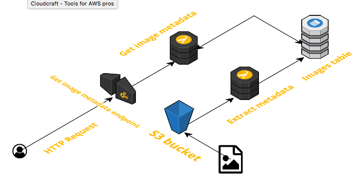
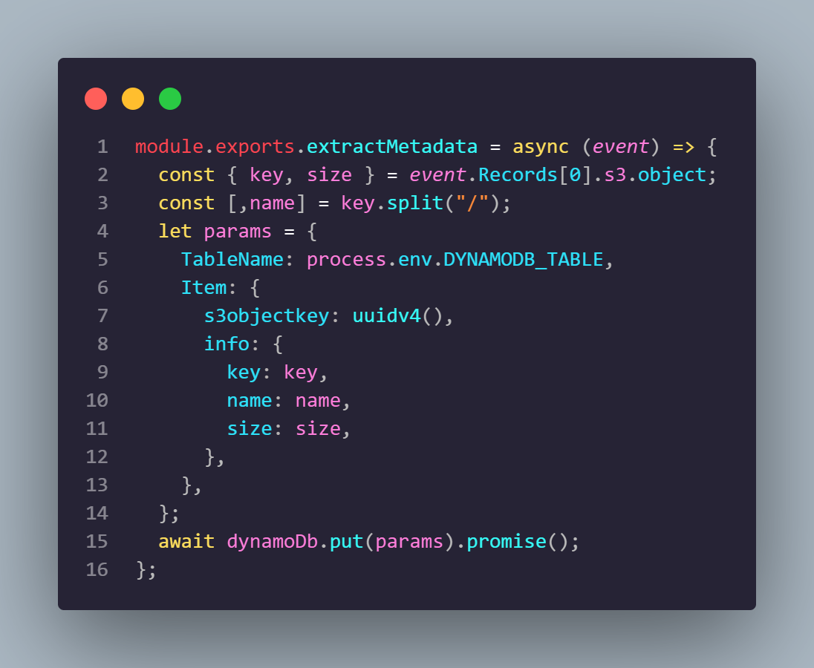
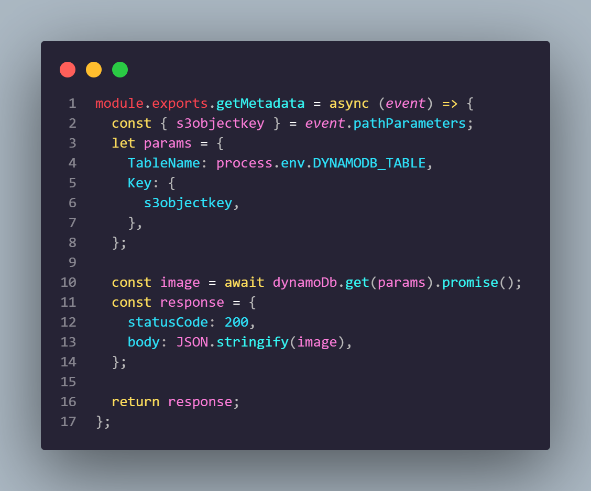
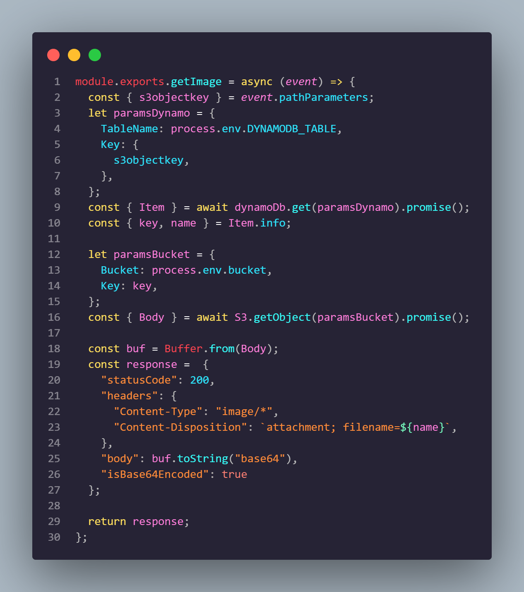
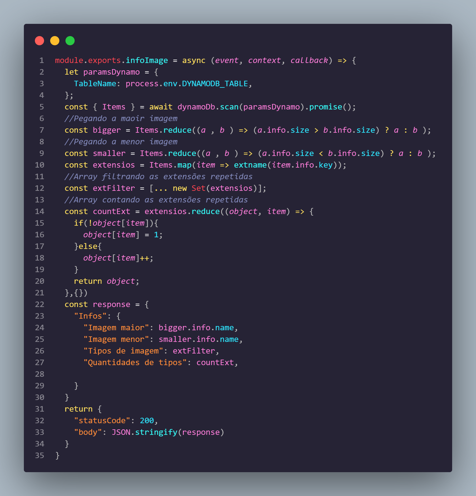

# serverless-challenge
Build a serverless architecture for image analysis 




Rodar o `npm install` antes de subir a aplicação.

## extractMetadata
A função `extractMetadata` é disparada quando alguma imagem é colocada no Bucket(nomeado no arquivo `serverless.yml`) dentro da pasta uploads que precisa ser criada após subir o código no Bucket especificado e salva as informações da imagem no DynamoDB.



Essa função recebe o `event` que vem do próprio Lambda, primeiro ela extrai o key e size que vem de dentro do event, depois faz uma destruturação a partir do key para obter o nome. Em seguida cria uma variável `params` que recebe um objeto com a estrutura e os valores que vão ser salvos no banco de dados, nesse escopo foi utilizado o `uuidv4` do pacote `uuid` para gerar o hash da chave primária, logo depois os valores são salvo no DynamoDB.

## getMetadata
A função `getMetadata` é disparada quando acessada a url criada pelo Lambda no recurso `images/{s3objectkey}`. O path recebe o parâmetro *s3objectkey* que é a chave primária salva no DynamoDB. A função busca e retorna o item referente ao *s3objectkey* passado no path.



Primeiro é pego o parâmetro *s3objectkey* atráves do `event` que é disponibilizado pelo Lambda. Depois é feito um objeto com o nome da tabela e a chave pela qual vai ser buscado o item. A função retorna o item encontrado no DynamoDB.

## getImage
A função `getImage` é disparada quando acessada a url criada pelo Lambda no recurso `download/{s3objectkey}`. Essa função também recebe o parâmetro *s3objectkey*. A função busca e baixa no disco local a imagem referente ao *s3objectkey* passado no path.



Primeiro a função vai buscar no DynamoDB o item pelo *s3objectkey* passado no path. Depois de buscar o item, é extraido o Key para poder buscar o corpo da imagem no S3. Em seguida é criado um buffer de `Body` para poder converter para Base64, a função retorna a imagem em si.

## infoImage
A função `infoImage` é disparada quando acessada a url criada pelo Lambda no recurso `/image`. 



A função vai buscar no DynamoDB todos os itens. Depois de buscar os itens é filtrado a maior e a menor imagem salva no banco de dados com o reduce, em seguida é extraido as extensões de todos os itens com `extname` do pacote `path`. A função retorna a maior imagem, a menor imagem, os tipos das imagens e a quantidade de tipos salvas no DynamoDB.

## Alterações no serverless.yml

*  Adicionei mais uma variável de ambiente:
```
environment:
    bucket: nomedobucket
```

* Adicionei o `binaryMediaTypes` para permitir baixar a imagem:
```
apiGateway:
    binaryMediaTypes:
      - '*/*'
```

* Coloquei na Action `s3:GetObject` para poder buscar arquivos no bucket.
* Adicionei mais 2 eventos de S3 para disparar o gatilho com os suffix de png e jpeg.
